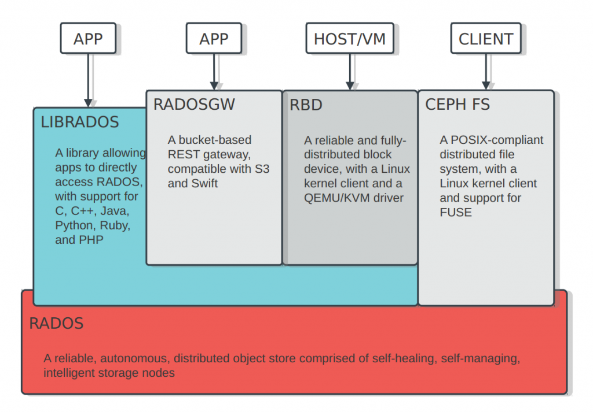

# Ceph

Ceph是一个开源的分布式存储系统，同时提供了对象存储、块存储和文件系统存储，主要特点包括:

* 高扩展性：使用普通x86服务器，支持10~1000台服务器，支持TB到PB级的扩展。
* 高可靠性：没有单点故障，多数据副本，自动管理，自动修复。
* 高性能：数据分布均衡，并行化度高。对于objects storage和block storage,不需要元数据服务器。

Ceph的核心是其最底层的基础存储系统RADOS，RADOS的上面提供了向本机上层提供API的基础库librados，面向Web调用提供的RADOS GW RESTful API，以及上层的块存储设备RBD和文件系统Ceph FS。



## 示例

**挂载rbd到host**

```
# rbd create --size=1G demo
# rbd map demo
/dev/rbd0
# mkfs.xfs /dev/rbd0
meta-data=/dev/rbd0              isize=256    agcount=9, agsize=31744 blks
         =                       sectsz=512   attr=2, projid32bit=1
         =                       crc=0        finobt=0
data     =                       bsize=4096   blocks=262144, imaxpct=25
         =                       sunit=1024   swidth=1024 blks
naming   =version 2              bsize=4096   ascii-ci=0 ftype=0
log      =internal log           bsize=4096   blocks=2560, version=2
         =                       sectsz=512   sunit=8 blks, lazy-count=1
realtime =none                   extsz=4096   blocks=0, rtextents=0
# mkdir /mnt/demo
# mount /dev/rbd0 /mnt/demo
```

**挂载Cephfs**

```
modprobe ceph
mkdir /mnt/cephfs
mount -t ceph 192.168.33.2:6789:/ /mnt/cephfs -o name=admin,secret=AQCeqZFXl96IFhAAWfONQRkve0PALi4meb5ICw==
```


**参考文档**

- <https://www.ustack.com/blog/ceph_infra/>

