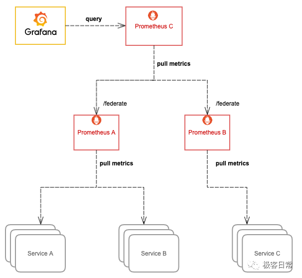

Kubernetes网络策略通常需要通过 YAML 来定义，在编写复杂网络策略时一点也不直观，很容易出错。虽然 Kubernetes 的官方文档已经详细介绍了网络策略的编写方法，但实际掌握起来也不太容易。今天，我就给大家介绍一个网络策略的可视化编辑器，方便你通过可视化界面编写网络策略。

<https://editor.cilium.io> 是 Cilium 出品的一个网络策略编辑器，支持通过可视化界面编写网络策略。比如，下面的网络策略并不容易一眼看出来其详细含义：

```yaml
apiVersion: networking.k8s.io/v1
kind: NetworkPolicy
metadata:
  name: my-policy
  namespace: my-namespace
spec:
  podSelector:
    matchLabels:
      app: backend
  policyTypes:
    - Ingress
    - Egress
  ingress:
    - from:
        - podSelector:
            matchLabels:
              app: frontend
      ports:
        - port: 443
        - port: 80
  egress:
    - to:
        - namespaceSelector: {}
          podSelector:
            matchLabels:
              k8s-app: kube-dns
      ports:
        - port: 53
          protocol: UDP
```

而 Cilium 提供的可视化编辑器则会将其展示为（其中红色表示禁止，而绿色表示允许）：



从这个图，你可以一眼看出网络策略的含义，即只允许 my-namespace 中标签为 app=frontend 的 Pod 访问相同 namespace 中标签为 app=backend 的 Pod，而 app=backend 的 Pod 则只能访问 Kubernetes DNS。

除了可视化展示，该编辑器还支持通过可视化向导编写网络策略（上图中的每个模块都可以点击修改），或者从 Hubble 导入的 flow 导入策略。你可以通过下面的 hubble 命令导出 flow：

```sh
hubble observe --json --last 1000 --follow --namespace my-namespace > my-namespace-flows.json
```


---

欢迎长按下面的二维码关注**漫谈云原生**公众号，输入**任意关键字**查询更多云原生知识库。


