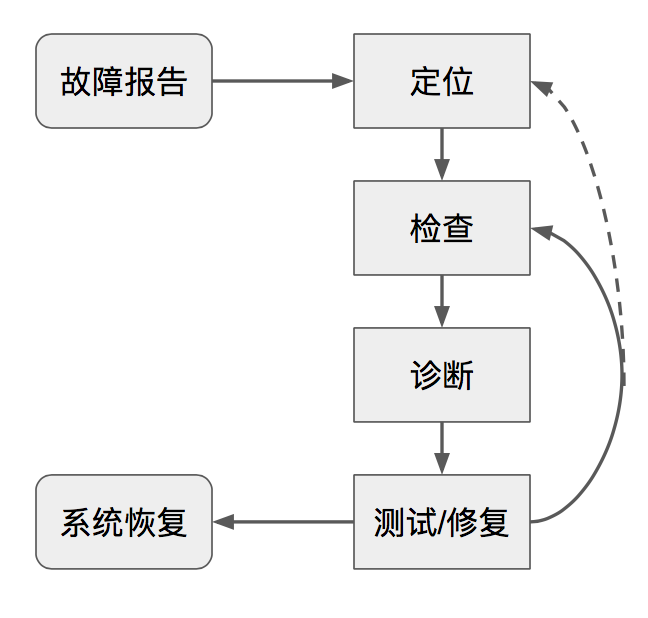

故障排查可以定义为一个反复“假设-排除”的过程：

### 常见陷阱

* 关注了错误的系统现象
* 不能正确的修改系统配置活着运行环境
* 过早将任务归结为极不可能的因素，注意不是所有问题出现的概率都相同
* 试图解决与当前问题相关的一些问题，相关性!=因果性

### 故障报告

* 故障报告存储在一个可以搜索的Bug纪录系统中（比如Redmine, BugZilla, JIRA等），便于调查历史和解决方案
* 为常见问题提供一个自服务分析工具或者自服务修复工具
* 不鼓励直接将bug汇报给某个人，容易导致低质量报告和压力集中
* 故障跟踪（如Google Outalator）：排列、聚合、标签分类、分析、报告

### **大型问题先尽最大可能恢复服务，然后再排查故障**

* 查看监控图表，通过图表相关性定位问题
* 日志，应用最好支持在线调整日志级别
* 分布式跟踪工具，比如Dapper
* 服务暴露目前系统的状态
* 真实客户端查看服务的响应
* 问题分解，大型系统中使用对分法
* 查看最后一个修改

### 测试和修复

* 测试应该具有互斥性
* 先测试最可能的情况
* 注意测试带来的副作用，比如资源占用引发其他问题等
* 公布负面结果，便于查阅已经排除了的设计、算法和工作流程，避免再次重复类似试验
* 为事故保留纪录，纪录排查、定位和修复问题的文档（验尸报告），但要注意对事不对人，避免职责，提供建设性意见，建立事后总结文化

### 使故障排查更简单

* 提供接口查询当前的任务和统计信息
* 每个组件增加白盒监控指标和结构化日志
* 利用成熟的、观察性好的组件接口设计系统

### 事故流程管理最佳实践

* 划分优先级，控制影响范围，恢复服务
* 事先和所有事故处理参与者制定一份流程
* 充分信任每一个事故处理参与者，分配职责后让他们自主行动
* 注意情绪和精神状态，惊慌时寻求更多的帮助
* 考虑替代方案
* 练习、熟悉流程
* 换位思考
