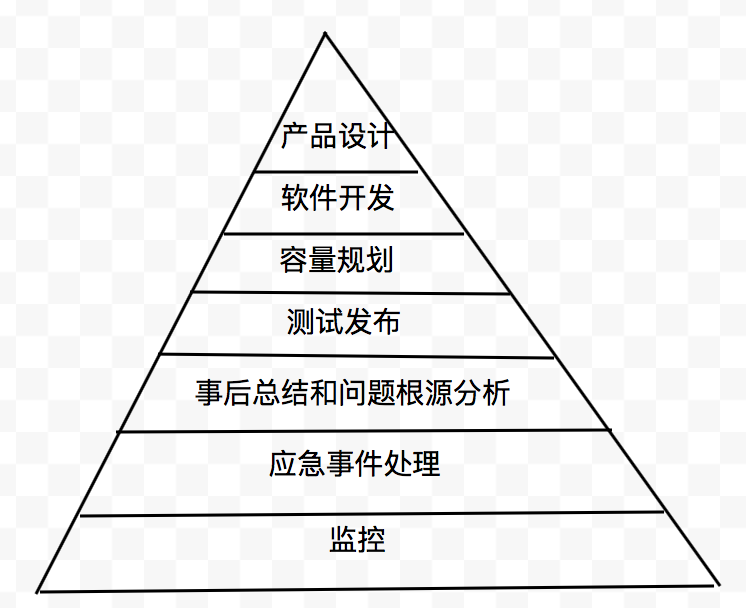

## SRE的目标

系统运维本质上是一个人与计算机共同参与的一项系统性工程。无论对一个软件系统运行原理掌握得多么彻底，都不能阻止人犯意外错误。Site Reliability Engineering (SRE)的关注焦点在于可靠性（平均失败时间MTTF和平均恢复时间MTTR的函数），用软件工程的思维和方法论完成以前由系统管理员团队手动完成的任务。

* 可用性改进
* 延迟优化
* 性能优化
* 效率优化
* 变更管理
* 监控
* 紧急事务处理
* 容量规划与管理

## SRE方法论

* 确保长期关注研发工作（运维工作限制在50%以内）
* 在保障服务SLO的前提下最大化迭代速度，基于错误预算（1-可靠性目标）解决研发团队与SRE团队冲突
* 监控系统不应该依赖人来分析报警信息，而是应该由系统自动分析，仅当需要用户执行某种操作的时候才通知（但要记录完善的日志以供需要时查询）
* 自动化恢复系统，需要手工处理的应急事件纪录“运维手册”
* 自动化变更管理：渐进式发布、迅速准确定位问题、异常时迅速回退
* 基于需求预测（自然增长和新功能发布、商业推广等非自然增长）规划系统容量，改进软件提供资源利用率

## 目录

1. [SRE指导思想](guideline.html)
1. [Google生产环境](google.html)
1. [监控与告警](monitor.html)
1. [on-call轮值](oncall.html)
1. [故障排查](diagnose.html)
1. [软件测试](testing.html)
1. [负载均衡](lb.html)
1. [避免连锁故障](cascading.html)
1. [分布式共识](distributed-consensus.html)
1. [定时任务](cron.html)
1. [数据流水线](pipeline.html)
1. [数据完整性](integrity.html)
1. [可靠发布](deploy.html)
1. [SRE管理](manage.html)
1. [附录](appendix.html)

**SRE层级模型**

**SRE book**

Google已经放出了SRE的免费电子书，可以直接在线阅读，<http://landing.google.com/sre/book/index.html>。全书共分为五个部分：

- [Part I - Introduction](http://landing.google.com/sre/book/chapters/part1.html)介绍SRE的概念以及在Google的应用
- [Part II - Principles](http://landing.google.com/sre/book/chapters/part2.html)介绍SRE的原则和机制
- [Part III - Practices](http://landing.google.com/sre/book/chapters/part3.html)介绍SRE实践
- [Part IV - Management](http://landing.google.com/sre/book/chapters/part4.html)介绍如何管理和协调组织内的各个团队
- [Part V - Conclusions](http://landing.google.com/sre/book/chapters/part5.html)最后是总结

----
**参考** _[Site Reliability Engineering: How Google Runs Production Systems](https://landing.google.com/sre/)_。
