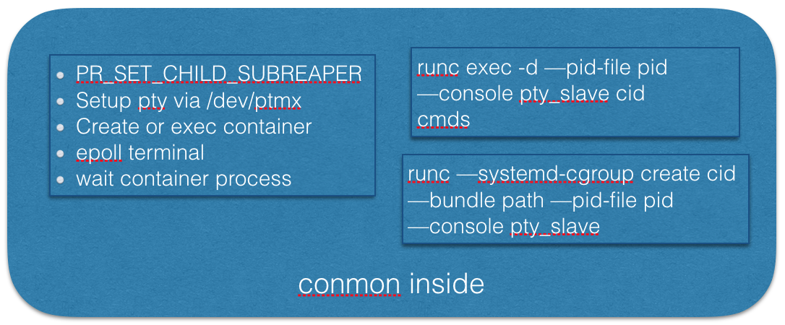

# cri-o

cri-o基于Kubelet容器运行时接口（CRI）为Kubernetes带来了原生的OCI运行时(目前仅支持runc)。cri-o还在紧张有序的开发中，预计与Kubernetes v1.5一起发布第一个alpha版本。

## cri-o原理

主要组成


Pod结构


conmon




## 编译安装

```sh
# CentOS/Fedora
# yum install -y btrfs-progs-devel device-mapper-devel glib2-devel glibc-devel glibc-static gpgme-devel libassuan-devel libgpg-error-devel pkgconfig libseccomp-devel
# Ubuntu
apt-get install -y linux-headers-$(uname -r) build-essential
apt-get install -y btrfs-tools libassuan-dev libc6-dev libdevmapper-dev  libglib2.0-dev libgpg-error-dev libgpgme11-dev pkg-config libapparmor-dev libseccomp-dev

# get and build runc
github.com/opencontainers/runc

# get and build cri-o
go get -d github.com/kubernetes-incubator/cri-o
cd $GOPATH/src/github.com/kubernetes-incubator/cri-o
make install.tools
make
make install
```

安装CNI：

```sh
go get -d github.com/containernetworking/cni
cd $GOPATH/src/github.com/containernetworking/cni
sudo mkdir -p /etc/cni/net.d
sudo sh -c 'cat >/etc/cni/net.d/10-mynet.conf <<-EOF
{
    "cniVersion": "0.2.0",
    "name": "mynet",
    "type": "bridge",
    "bridge": "cni0",
    "isGateway": true,
    "ipMasq": true,
    "ipam": {
        "type": "host-local",
        "subnet": "10.88.0.0/16",
        "routes": [
            { "dst": "0.0.0.0/0"  }
        ]
    }
}
EOF'
sudo sh -c 'cat >/etc/cni/net.d/99-loopback.conf <<-EOF
{
    "cniVersion": "0.2.0",
    "type": "loopback"
}
EOF'
./build
sudo mkdir -p /opt/cni/bin && sudo cp bin/* /opt/cni/bin/
```

## cri-o单独使用

```sh
# Start ocid
ocid --runtime $(which runc) --debug

# Play with ocid
ocic pod create --config test/testdata/sandbox_config.json
ocic pod list
ocic ctr create --pod 31885791dfa4c112ef1a61bad89b347aa37a7d35177578451c5c512c19b6396a --config test/testdata/container_redis.json
ocic ctr start --id e28b037b26690075456f4e51318314544d6e226a85c103080e5dd818e936341a
```

启动一个redis容器后的进程关系：

```
 ├─ocid ExecReload=/bin/kill -s HUP
  │   ├─conmon -c default-podsandbox1-0-infra -r /usr/local/sbin/runc
  │   │   └─pause
  │   ├─conmon -c default-podsandbox1-0-podsandbox1-redis-0 -r /usr/local/sbin/runc
  │   │   └─redis-server
  │   │       └─2*[{redis-server}]
  │   └─9*[{ocid}]
```

```
      ├─13009 ocid --runtime /usr/sbin/runc --debug
      ├─13049 /usr/libexec/ocid/conmon -c default-podsandbox1-0-infra -r /usr/sbin/runc
      ├─16081 /usr/libexec/ocid/conmon -c default-podsandbox1-0-podsandbox1-redis-0 -r /usr/sbin/runc
      ├─podsandbox1.slice:container:infra
      │ └─13058 /pause
      └─default-podsandbox1-0-podsandbox1-redis-0
        └─16090 redis-server *:6379
```

## Kubernetes cri-o

```sh
CONTAINER_RUNTIME=remote CONTAINER_RUNTIME_ENDPOINT='/var/run/ocid.sock --runtime-request-timeout=15m' ./hack/local-up-cluster.sh
```


