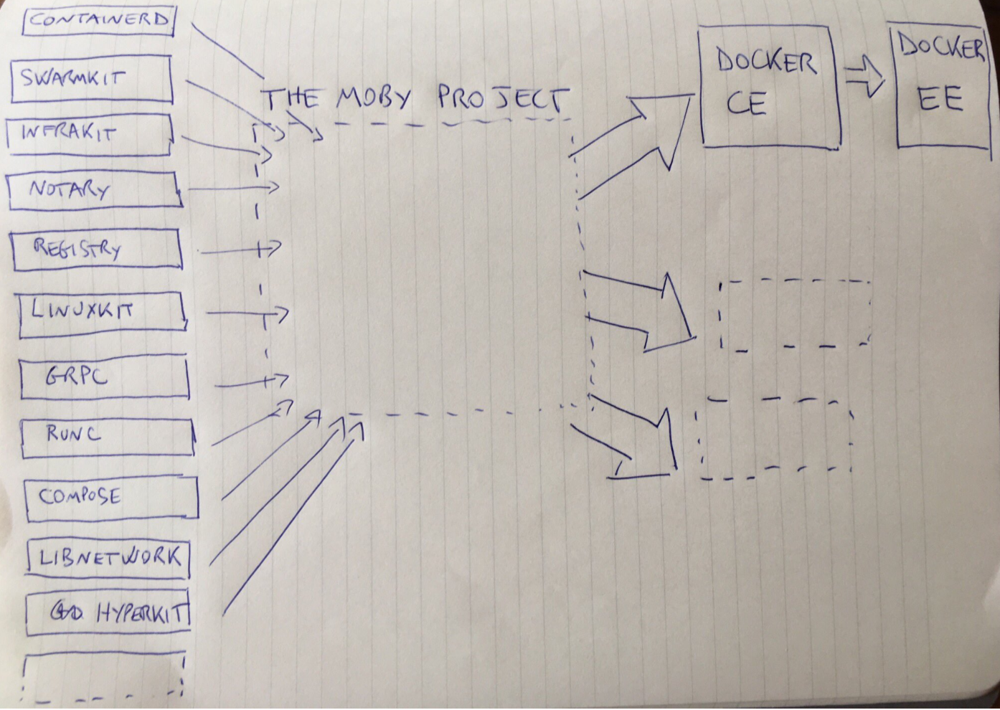
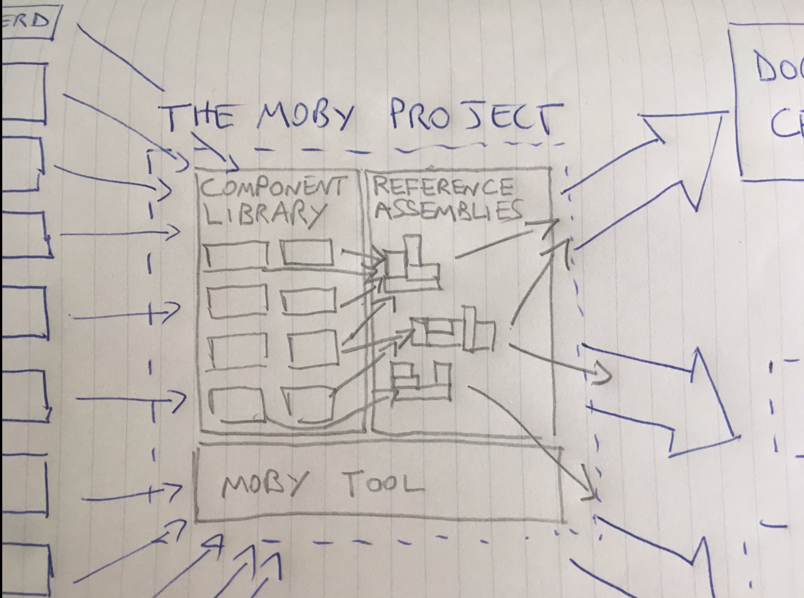

在DockerCon 2017上，Docker公司将原来的开源项目重命名为[Moby](https://github.com/moby/moby)，Docker从此只是产品名字，大家所用的Docker变成了Docker CE，而Docker公司则会想办法将用户转移到Docker EE上。这是Docker开启商业化必然的一步，同时也是Docker公司对社区质疑的回应：

Moby将原来的Docker组件化，拆分为更细的各个组件，并提供一个组合在一起的方式（即Docker CE的构建）。这样，如果大家再不满意Docker CLI，那也可以用这些组件去创建自己的版本，而这比之前的Docker fork有一个明显的好处：大部分组件大家都可以共享，这有利于开源项目的进展。并且，Docker也正打算把Moby贡献给CNCF。

## 参考文档

- <https://github.com/moby/moby>
- <https://mobyproject.org>
- <https://www.zhihu.com/question/58805021>
- <https://news.ycombinator.com/item?id=14156954>