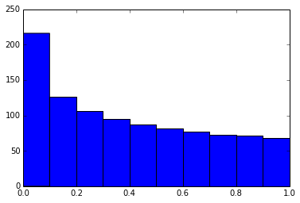

# Jupyter notebook tips

Jupyter notebook is formerly known as IPython notebook, it is a tool that helps you create readable analyses. Jupyter works with python kernel by default, but it also supports many other kernels.

**Keyboard shortcurts**

- `Cmd + Shift + P`: open command palette

**Set environment variables**


```python
# The line below sets the environment
# variable OMP_NUM_THREADS
%env OMP_NUM_THREADS=4
```

    env: OMP_NUM_THREADS=4


**Execute python code**


```python
# this will execute and show the output from
# all code cells of the specified notebook
%run ./helloworld.py
```

    Hello, TensorFlow!
    [ 2.  4.  6.]
    [[  2.   4.   6.]
     [  8.  10.  12.]]


**load code to current cell**


```python
# %load helloworld.py
#!/usr/bin/env python
import tensorflow as tf

# Create a Constant op
# The op is added as a node to the default graph.
#
# The value returned by the constructor represents the output
# of the Constant op.
hello = tf.constant('Hello, TensorFlow!')
x = tf.placeholder("float", 3)
a = tf.placeholder("float", shape=[None, 3])

y = x*2
b = a*2

# Start tf session
sess = tf.Session()
sess.run(tf.initialize_all_tables())

print sess.run(hello)
print sess.run(y, feed_dict={x:[1,2,3]})
print sess.run(b, feed_dict={a:[[1,2,3], [4,5,6]]})

sess.close()

```

**Pass variables between notebooks**


```python
data = 'this is the string I want to pass to different notebook'
%store data
del data # This has deleted the variable

%store -r data
print(data)
```

    Stored 'data' (str)
    this is the string I want to pass to different notebook


**Plot inline**


```python
%matplotlib inline

from matplotlib import pyplot as plt
import numpy

x = numpy.linspace(0, 1, 1000)**1.5;
plt.hist(x);
```





**Latex forumlas**

$$ P(A \mid B) = \frac{P(B \mid A) \, P(A)}{P(B)} $$

**Writing functions in other languages**


```python
!pip install cython fortran-magic

%load_ext Cython

%%cython
def myltiply_by_2(float x):
    return 2.0 * x

myltiply_by_2(23.)
```

**Other jupyter magic**

- `%matplotlib inline`: plot inline.
- `%who`: List all variables of global scope.
- `%%time` and `%timeit`: timing the code.
- `%lsmagic`: list magic commands
- `%%writefile pythoncode.py`: export contents of the cell to pythoncode.py
- `%pycat pythoncode.py`: show the contents of an external script
- `%prun`: Show how much time your program spent in each function.
- `%pdb`: debugging with pdb.
- `!pip install numpy`: executing shell commands.
- `%%bash`, `%%HTML`, `%%ruby`, `%%R`: swith to other kernel.

**Jupyter-contrib extensions**

```
!pip install https://github.com/ipython-contrib/jupyter_contrib_nbextensions/tarball/master
!pip install jupyter_nbextensions_configurator
!jupyter contrib nbextension install --user
!jupyter nbextensions_configurator enable --user
```

**Create a presentation**

```
!pip install RISE

jupyter-nbextension install rise --py --sys-prefix
jupyter-nbextension enable rise --py --sys-prefix
```


```python

```
