# Data Visualization

There are many libraries can be used to visualize data, including pandas, matplotlib and seaborn.

## matplotlib


```python
import matplotlib.pyplot as plt
import numpy as np
%matplotlib inline

t = np.arange(0., 5., 0.2)
plt.plot(t, t, "r--", t, t**2, "bs", t, t**3, "g^")
plt.ylabel("some numbers")
plt.title("Hello, matplot")
```


    <matplotlib.text.Text at 0x7ff19c81be90>


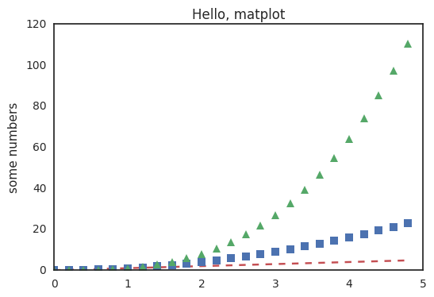


```python
# using subplots
def f(t):
    return np.exp(-t) * np.cos(2*np.pi*t)

t1 = np.arange(0.0, 5.0, 0.1)
t2 = np.arange(0.0, 5.0, 0.02)

plt.figure(1)
plt.subplot(211)
plt.plot(t1, f(t1), 'bo', t2, f(t2), 'k')
plt.subplot(212)
plt.plot(t2, np.cos(2*np.pi*t2), 'r--')
```


    [<matplotlib.lines.Line2D at 0x7ff19c90fdd0>]


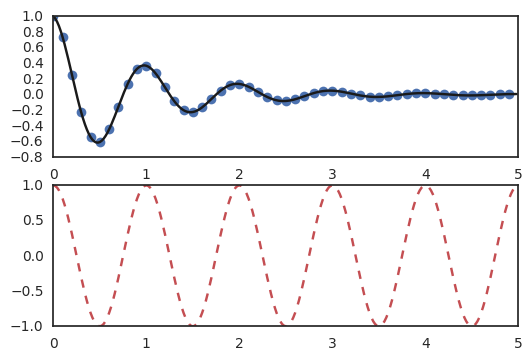


```python
# using annotations
ax = plt.subplot(111)
t = np.arange(0.0, 5.0, 0.01)
s = np.cos(2*np.pi*t)
line, = plt.plot(t, s, lw=2)
plt.annotate('local max', xy=(2, 1), xytext=(3, 1.5),
            arrowprops=dict(facecolor='black', shrink=0.05),
            )
plt.ylim(-2,2);
```


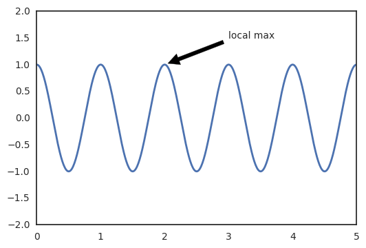


```python
def f(x, y):
    return (1 - x / 2 + x ** 5 + y ** 3) * np.exp(-x ** 2 -y ** 2)

n = 256
x = np.linspace(-3, 3, n)
y = np.linspace(-3, 3, n)
X, Y = np.meshgrid(x, y)

plt.contourf(X, Y, f(X, Y), 8, alpha=.75, cmap='jet')
C = plt.contour(X, Y, f(X, Y), 8, colors='black', linewidth=.5)
```


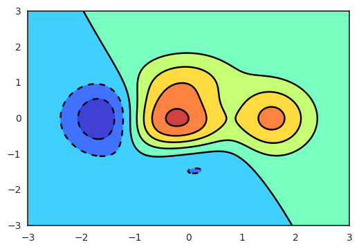


```python
def f(x, y):
    return (1 - x / 2 + x ** 5 + y ** 3) * np.exp(-x ** 2 - y ** 2)

n = 10
x = np.linspace(-3, 3, 4 * n)
y = np.linspace(-3, 3, 3 * n)
X, Y = np.meshgrid(x, y)
plt.imshow(f(X, Y))
```


    <matplotlib.image.AxesImage at 0x7ff19c9b3fd0>


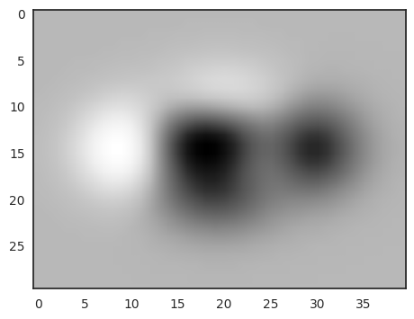


```python
Z = np.random.uniform(0, 1, 20)
plt.pie(Z);
```


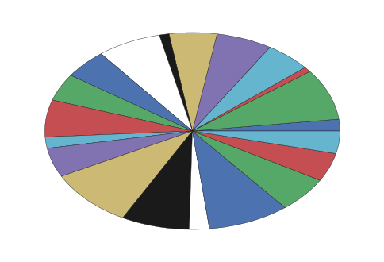


## pandas


```python
import pandas as pd
import seaborn as sns
import requests
import warnings

warnings.filterwarnings("ignore")
sns.set(style="white", color_codes=True)

r = requests.get("https://raw.githubusercontent.com/uiuc-cse/data-fa14/gh-pages/data/iris.csv", stream=True)
if r.status_code == 200:
    with open("/tmp/iris.csv", 'wb') as f:
        for chunk in r.iter_content(1024):
            f.write(chunk)
```


```python
iris = pd.read_csv("/tmp/iris.csv")
iris.head()
```


<div>
<table border="1" class="dataframe">
  <thead>
    <tr style="text-align: right;">
      <th></th>
      <th>sepal_length</th>
      <th>sepal_width</th>
      <th>petal_length</th>
      <th>petal_width</th>
      <th>species</th>
    </tr>
  </thead>
  <tbody>
    <tr>
      <th>0</th>
      <td>5.1</td>
      <td>3.5</td>
      <td>1.4</td>
      <td>0.2</td>
      <td>setosa</td>
    </tr>
    <tr>
      <th>1</th>
      <td>4.9</td>
      <td>3.0</td>
      <td>1.4</td>
      <td>0.2</td>
      <td>setosa</td>
    </tr>
    <tr>
      <th>2</th>
      <td>4.7</td>
      <td>3.2</td>
      <td>1.3</td>
      <td>0.2</td>
      <td>setosa</td>
    </tr>
    <tr>
      <th>3</th>
      <td>4.6</td>
      <td>3.1</td>
      <td>1.5</td>
      <td>0.2</td>
      <td>setosa</td>
    </tr>
    <tr>
      <th>4</th>
      <td>5.0</td>
      <td>3.6</td>
      <td>1.4</td>
      <td>0.2</td>
      <td>setosa</td>
    </tr>
  </tbody>
</table>
</div>


```python
# Let's see how many examples we have of each species
iris["species"].value_counts()
```


    setosa        50
    versicolor    50
    virginica     50
    Name: species, dtype: int64


```python
# The first way we can plot things is using the .plot extension from Pandas dataframes
# We'll use this to make a scatterplot of the Iris features.
iris.plot(kind="scatter", x="sepal_length", y="sepal_width")
```


    <matplotlib.axes._subplots.AxesSubplot at 0x7ff1a776ed90>


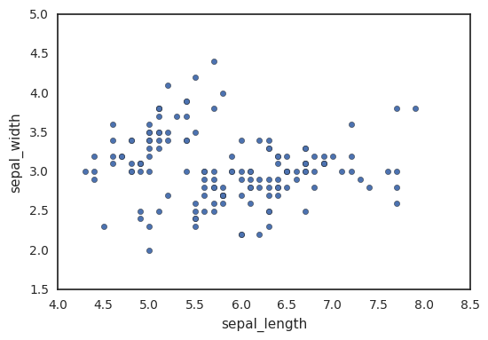


```python
# We can also use the seaborn library to make a similar plot
# A seaborn jointplot shows bivariate scatterplots and univariate histograms in the same figure
sns.jointplot(x="sepal_length", y="sepal_width", data=iris, size=5)
```


    <seaborn.axisgrid.JointGrid at 0x7ff1a7710410>


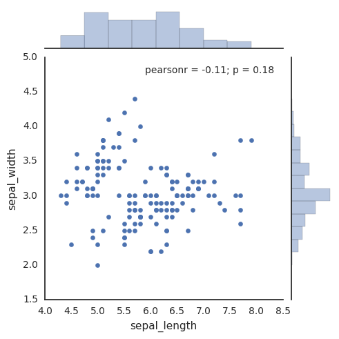


```python
# One piece of information missing in the plots above is what species each plant is
# We'll use seaborn's FacetGrid to color the scatterplot by species
sns.FacetGrid(iris, hue="species", size=5) \
   .map(plt.scatter, "sepal_length", "sepal_width") \
   .add_legend()
```


    <seaborn.axisgrid.FacetGrid at 0x7ff1a71f7390>


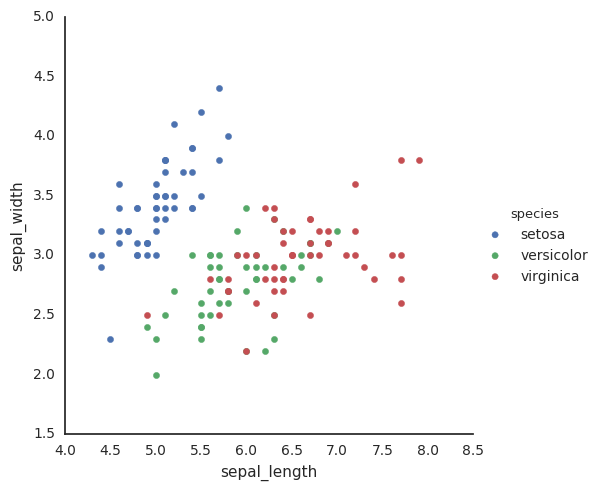


```python
# We can look at an individual feature in Seaborn through a boxplot
sns.boxplot(x="species", y="petal_length", data=iris)
```


    <matplotlib.axes._subplots.AxesSubplot at 0x7ff1a70d5990>


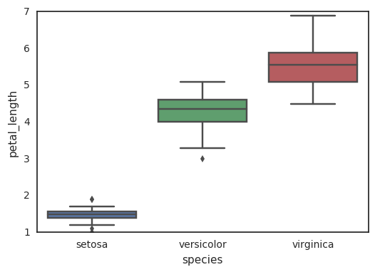


```python
# One way we can extend this plot is adding a layer of individual points on top of
# it through Seaborn's striplot
# 
# We'll use jitter=True so that all the points don't fall in single vertical lines
# above the species
#
# Saving the resulting axes as ax each time causes the resulting plot to be shown
# on top of the previous axes
ax = sns.boxplot(x="species", y="petal_length", data=iris)
ax = sns.stripplot(x="species", y="petal_length", data=iris, jitter=True, edgecolor="gray")
```


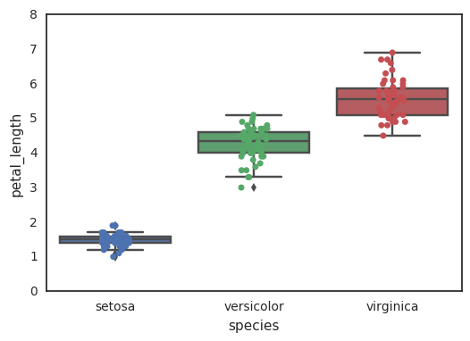


```python
# A violin plot combines the benefits of the previous two plots and simplifies them
# Denser regions of the data are fatter, and sparser thiner in a violin plot
sns.violinplot(x="species", y="petal_length", data=iris, size=6)
```


    <matplotlib.axes._subplots.AxesSubplot at 0x7ff1a6de1e90>


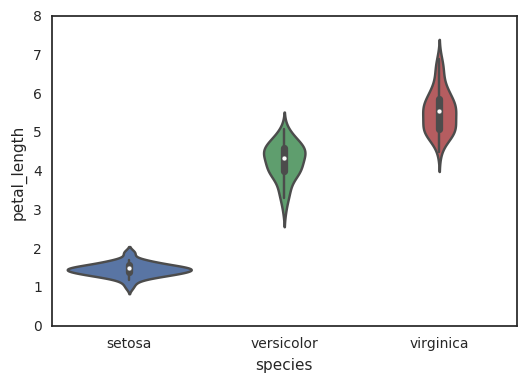


```python
# A final seaborn plot useful for looking at univariate relations is the kdeplot,
# which creates and visualizes a kernel density estimate of the underlying feature
sns.FacetGrid(iris, hue="species", size=6) \
   .map(sns.kdeplot, "petal_length") \
   .add_legend()
```


    <seaborn.axisgrid.FacetGrid at 0x7ff1a6b14fd0>


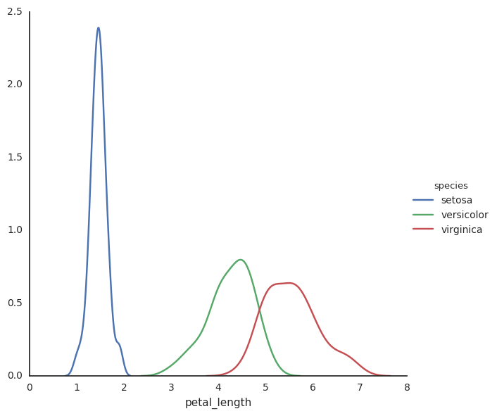


```python
# Another useful seaborn plot is the pairplot, which shows the bivariate relation
# between each pair of features
# 
# From the pairplot, we'll see that the Iris-setosa species is separataed from the other
# two across all feature combinations
sns.pairplot(iris, hue="species", size=3)
```


    <seaborn.axisgrid.PairGrid at 0x7ff1a6b1df10>


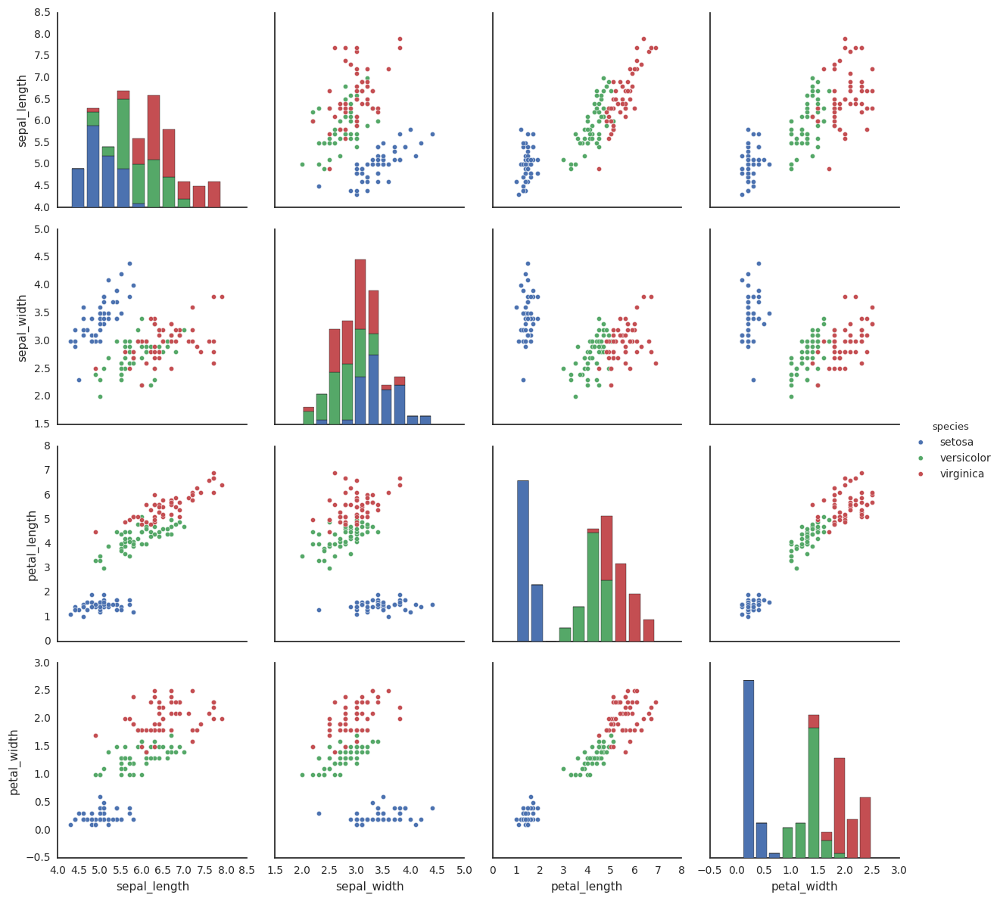


```python
# The diagonal elements in a pairplot show the histogram by default
# We can update these elements to show other things, such as a kde
sns.pairplot(iris, hue="species", size=3, diag_kind="kde")
```


    <seaborn.axisgrid.PairGrid at 0x7ff1a610c750>


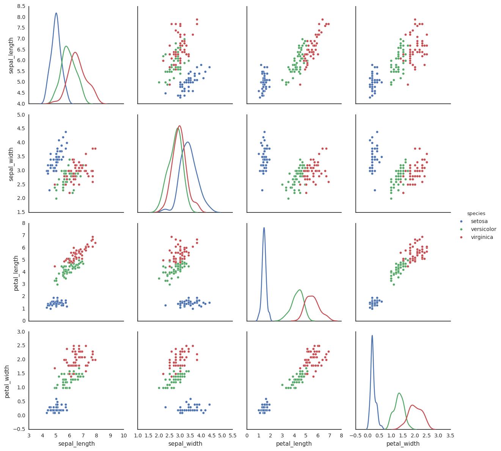


```python
# Now that we've covered seaborn, let's go back to some of the ones we can make with Pandas
# We can quickly make a boxplot with Pandas on each feature split out by species
iris.boxplot(by="species", figsize=(12, 6))
```


    array([[<matplotlib.axes._subplots.AxesSubplot object at 0x7ff19e22b910>,
            <matplotlib.axes._subplots.AxesSubplot object at 0x7ff19da942d0>],
           [<matplotlib.axes._subplots.AxesSubplot object at 0x7ff19db5d290>,
            <matplotlib.axes._subplots.AxesSubplot object at 0x7ff19da42210>]], dtype=object)


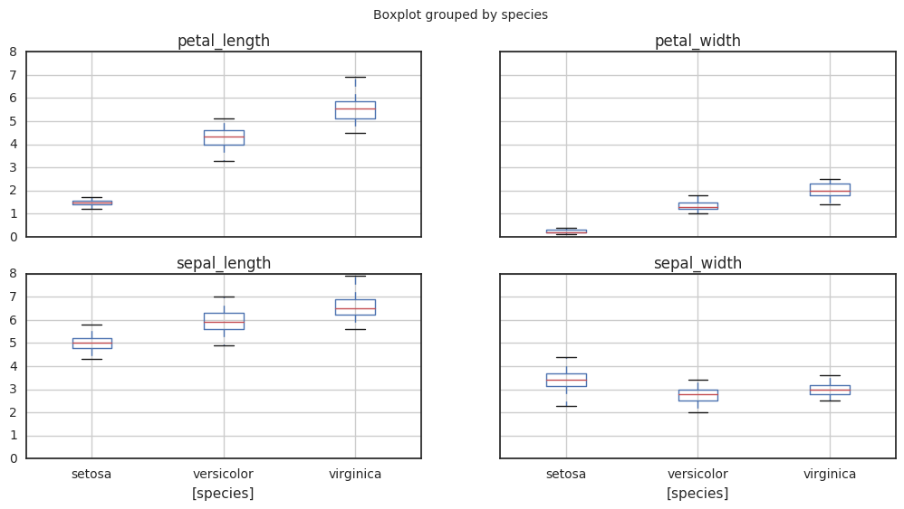


```python
# One cool more sophisticated technique pandas has available is called Andrews Curves
# Andrews Curves involve using attributes of samples as coefficients for Fourier series
# and then plotting these
from pandas.tools.plotting import andrews_curves
andrews_curves(iris, "species") #.drop("Id", axis=1)
```


    <matplotlib.axes._subplots.AxesSubplot at 0x7ff19d68af50>


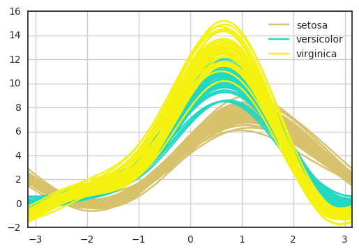


```python
# Another multivariate visualization technique pandas has is parallel_coordinates
# Parallel coordinates plots each feature on a separate column & then draws lines
# connecting the features for each data sample
from pandas.tools.plotting import parallel_coordinates
parallel_coordinates(iris, "species") #.drop("Id", axis=1)
```


    <matplotlib.axes._subplots.AxesSubplot at 0x7ff19d2a0790>


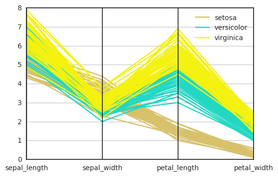


```python
# A final multivariate visualization technique pandas has is radviz
# Which puts each feature as a point on a 2D plane, and then simulates
# having each sample attached to those points through a spring weighted
# by the relative value for that feature
from pandas.tools.plotting import radviz
radviz(iris, "species")
```


    <matplotlib.axes._subplots.AxesSubplot at 0x7ff19cee8710>


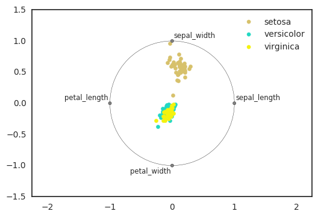


```python

```
