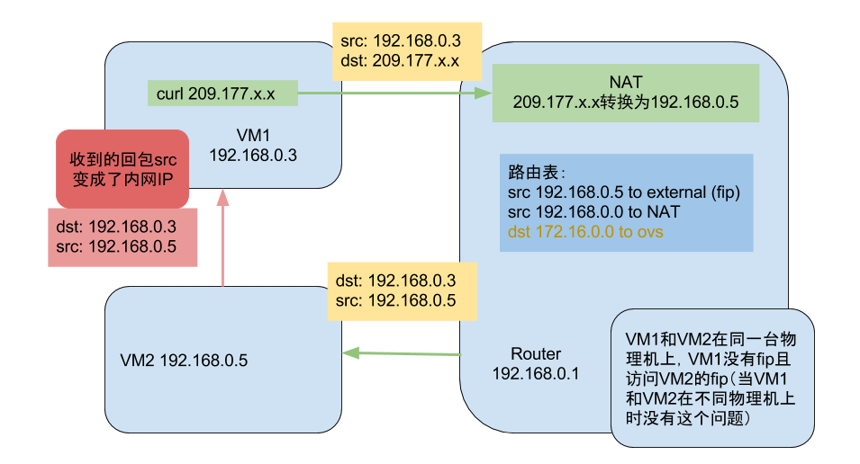
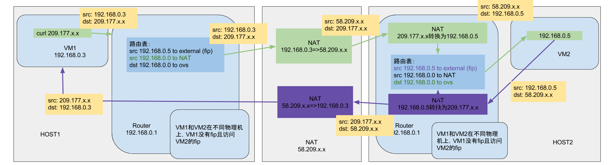

# 分布式路由
OpenStack 用户可能会发现，按照 Neutron 原先的设计，所有网络服务都在网络节点上进行，这意味着大量的流量和处理，给网络节点带来了很大的压力。

这些处理的核心是路由器服务。任何需要跨子网的访问都需要路由器进行路由。

很自然，能否让计算节点上也运行路由器服务？这个设计思路无疑是更为合理的，但具体实施起来需要诸多细节上的技术考量。

为了降低网络节点的负载，同时提高可扩展性，OpenStack 自 Juno 版本开始正式引入了分布式路由（Distributed Virtual Router，DVR）特性（用户可以选择使用与否），来让计算节点自己来处理原先的大量东西向流量和非 SNAT 南北流量（有 floating IP 的 vm 跟外面的通信）。

这样网络节点只需要处理占到一部分的 SNAT （无 floating IP 的 vm 跟外面的通信）流量，大大降低了负载和整个系统对网络节点的依赖。很自然的，FWaaS 也可以跟着放到计算节点上。

DHCP 服务、VPN 服务目前仍然需要集中在网络节点上进行。

## DVR路由问题

如果同一租户的VM调度到相同的机器上（假设为VM1和VM2），VM1没有绑定fip，而VM2绑定了fip（假设为fip2）。这时，从VM1内ping fip2，会发现回包地址为VM2的内网IP；并且，从VM1中访问fip2的服务是不通的（比如nginx服务不同），原因还是回包的地址是内网IP，跟请求地址不一致： 

而当这些VM在不同机器上时候，没有这个问题：

解决方法就是把这种请求绕道NAT机器上去，而不经过本地的router。
